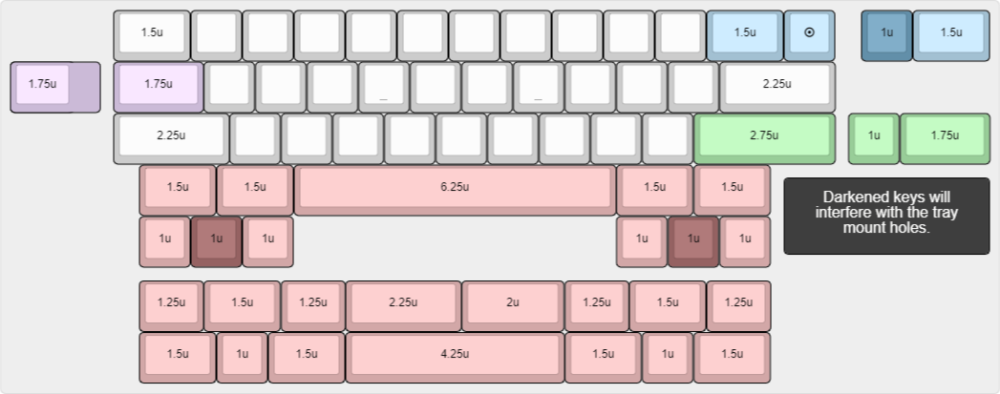
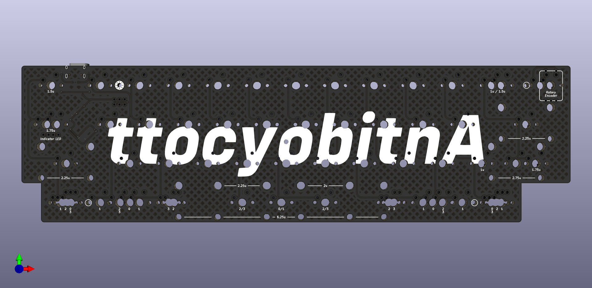
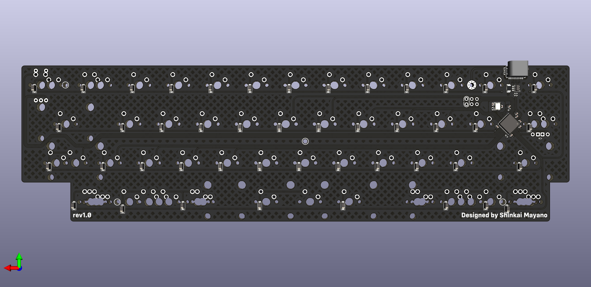

# ttocyobitnA

ttocyobitnA (or Antiboycott) is a drop-in replacement of [Ttocyobitna](https://trashman.wiki/en/keyboards/ttocyobitna) made by [Trash Man](https://trashman.club/) while under the alias of Pycki47.

---

## Status

**Currently Untested.** ***Order at your own risk.***

Note: JLCPCB may not have a preview show since they struggle to render hatched fills. It did preview fine with a solid fill though so it should be fine.

Dimensions: 266.67mm x 76.17mm

---

## Changes

- Revamped Eeschema
  - Makes use of more default KiCad 6 libraries
    - Only external libraries are [marbastlib](https://github.com/ebastler/marbastlib) and [ai03's Switch Symbol](https://github.com/ai03-2725/MX_Alps_Hybrid)
  - Tray mount holes are now included in the schematic
- Revamped PCBNew
  - Rerouted with curved traces and hatched GND fill
  - Capacitors and resistors have been changed to 0402
  - Replaced 1u for a 10u capacitor on the VBUS Pin
  - Replaced TVS diode array with a SRV05-4 ESD IC
  - Switched USB-C footprint to the more common HRO-M-12
  - Added an extra 100nF decoupling capacitor
  - Added ISP breakout
    - Also acts as an RGB strip breakout
    - Removed reset button
  - Proper shield implementation (4.7nF capacitor, 1M resistor, and a screw hole connected to Earth)
- More layout options (see KLE below)
  - Added silkscreen text to clearly demarcate mod size and layout options
  - Rotary encoder support in the top right as well as 1u/1.5u
  - Stepped caps-lock support
    - supports THT LED indicator
  - Full 2.75u right shift
  - 6.25u Spacebar bottom row

---

## Renders

